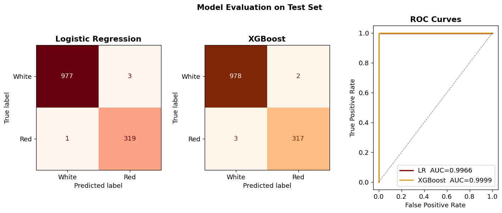
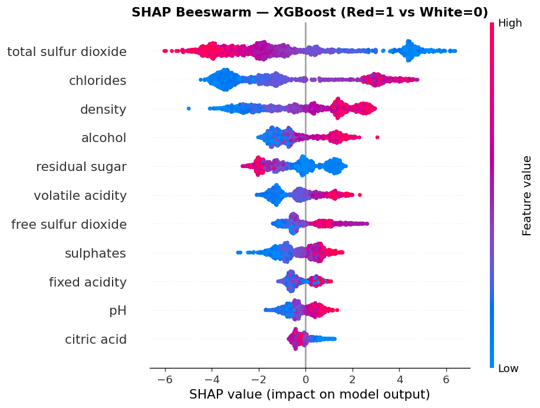
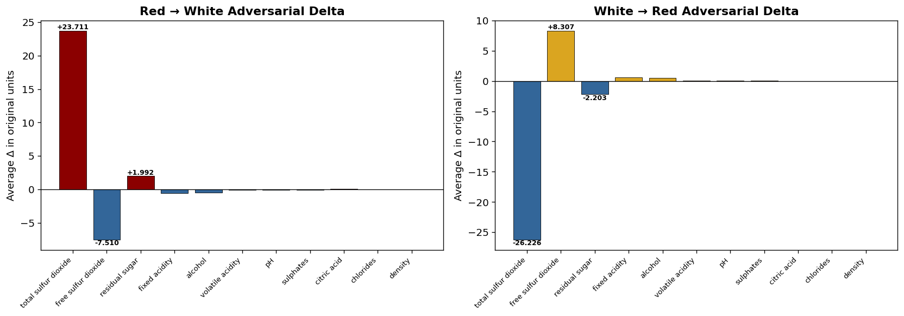

# Wine Color Classification + Adversarial Analysis

Binary classification of red vs. white wine (6,497 samples, 11 chemical features) — built as a three-iteration learning progression from raw gradient descent to adversarial robustness analysis.

---

## Flagship Notebook: `wine_adversarial_pipeline.ipynb`

**Full ML lifecycle with adversarial perturbation analysis.**

> *What is the minimal chemical perturbation that flips a wine's classification?*

The logistic regression model learns a hyperplane in 11-dimensional chemical space. Using **FGSM-style adversarial attacks** we analytically locate that boundary and expose which chemical properties are most exploitable — directly connecting classical ML interpretability to adversarial robustness.

### Pipeline

```
EDA → LR vs. XGBoost → SHAP Explainability → Adversarial Perturbation → Transfer Attack
```

### Model Results

| Model | CV Accuracy | CV F1 | Test F1 | Test ROC-AUC |
|---|---|---|---|---|
| Logistic Regression | 0.9929 ± 0.0030 | 0.9855 ± 0.0061 | **0.9938** | **0.9966** |
| XGBoost | 0.9958 ± 0.0034 | 0.9913 ± 0.0071 | **0.9922** | **0.9999** |

*5-fold stratified cross-validation on 6,497 samples.*



### SHAP Feature Importance

**Total sulfur dioxide** dominates — white wines retain far more SO₂ from winemaking.  
**Volatile acidity** (acetic acid) is the second strongest separator, consistently higher in reds.



### Adversarial Analysis

| Finding | Detail |
|---|---|
| Attack method | FGSM (L∞ norm) adapted for logistic regression |
| Minimum ε range | [0.0016, 0.9870] in standardized space — most wines need large perturbations |
| Most vulnerable | Red wine at ε_min = 0.00163 — already at the boundary |
| Top exploitable feature | Total sulfur dioxide (+0.09 mg/L flips that wine's classification) |
| SHAP ↔ exploitability | Same features drive predictions AND are most exploitable — the model's strength is its attack surface |
| Transfer rate | 16.9% of LR adversaries fool XGBoost (18.5% red→white, 16.4% white→red) |



The **adversarial recipe** output shows the exact chemical changes per feature: the most boundary-adjacent red wine is misclassified as white by increasing total sulfur dioxide by just **+0.09 mg/L** and adjusting free sulfur dioxide by **-0.03 mg/L** — perturbations far below measurement noise in a real winery.

---

## Learning Progression

The original three notebooks document the learning arc from scratch implementation to library-based ML:

### `Single_Neuron_Classifier_One` — Manual Gradient Descent
- Logistic regression built from scratch
- Gradient descent implemented by hand (squared error loss)
- Exposed the mechanics of weight updates and training loops

### `Single_Neuron_Classifier_Two` — Binary Cross-Entropy + Manual Split
- Replaced squared error with BCE (the correct loss for binary classification)
- Manual train/test split for proper validation
- Faster convergence, same architecture

### `Single_Neuron_Classifier_using_sklearn` — sklearn Pipeline
- `StandardScaler` → `LogisticRegression` pipeline
- `train_test_split` with randomization and stratification
- Significant accuracy improvement from proper feature scaling

---

## Setup

```bash
pip install numpy pandas matplotlib seaborn scikit-learn xgboost shap
```

Run `wine_adversarial_pipeline.ipynb` locally — data files are included in `data/`.

For the original Colab notebooks, upload `data/winequality-red.csv` and `data/winequality-white.csv` when prompted.

---

## Dataset

UCI Wine Quality — Cortez et al., 2009  
1,599 red wine samples + 4,898 white wine samples  
11 physicochemical features: fixed acidity, volatile acidity, citric acid, residual sugar, chlorides, free/total sulfur dioxide, density, pH, sulphates, alcohol

Adversarial method: Fast Gradient Sign Method (Goodfellow et al., 2014)
